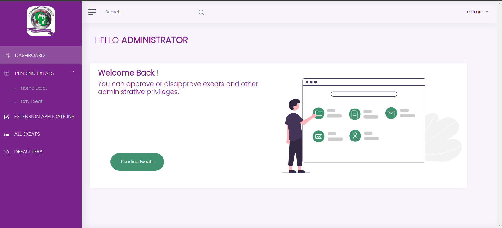

# Exeat-Portal
## Login Details

**Student**

> username: student \
> passoword: User123@

**Exeat Team**
> username: team \
> password: User123@

**Admin**
> username: admin \
> password: User123@

**Security**
> username: Security \
> password: User123@

## Student Dashboard

### Features
- Apply for various types of exeat
- View Exeat Status
- Change User Settings 
- View User Information

## Exeat Team Dashboard

### Features
- Acceptance/Rejection of already approved exeat
- View All exeat status
- Change User Settings 
- View User Information

## Admin Dashboard

### Features
- Approval/Rejection of Exeat
- Approval/Rejectio of exeat extentions
- Viewing all Exeats
- Viewing Exeat defulters
- View User Information
